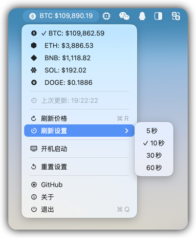

# BTC 价格监控器

<div align="center">


一款 macOS 原生菜单栏应用，用于实时监控主流虚拟货币价格，支持 BTC/ETH/BNB/SOL/DOGE 多种币种。之前使用Python写过虽然也蛮好用但最终还是决定用 macOS 原生语言来重写，已经编译了`Intel`与`Apple Silicon`的通用应用，请至[releases](https://github.com/jiayouzl/Bitcoin-Monitoring/releases/latest)下载。

</div>

## 📖 如在macOS下无法运行，请执行以下步骤：
> 系统设置 → 隐私与安全性 → 安全性 → 已阻止“Bitcoin Monitoring.app”以保护Mac → 仍要打开

## 📷︎ 界面预览



## ✨ 功能特性

### 🚀 核心功能
- **多币种支持**: 支持 BTC/ETH/BNB/SOL/DOGE 主流虚拟货币价格监控
- **实时价格显示**: 在菜单栏实时显示选中币种的 USDT 价格
- **多种刷新机制**: 可选 5、10、30、60 秒自动获取最新价格数据
- **智能错误重试**: 网络异常时自动重试，最多 3 次
- **手动刷新**: 支持快捷键 `Cmd+R` 手动刷新价格
- **状态指示**: 直观显示加载、更新、错误状态
- **价格复制功能**: 支持一键复制当前价格到剪贴板
- **配置持久化**: 用户设置自动保存，重启后保持配置
- **开机自启动**: 可选是否开机自动启动APP

### 🎨 用户体验
- **中文界面**: 完整的中文用户界面
- **优雅动画**: 流畅的状态切换动画
- **轻量级设计**: 最小化系统资源占用
- **后台运行**: 不占用 Dock 空间，专注菜单栏
- **SF Symbols 图标**: 使用原生 macOS 图标系统

### 🛡️ 可靠性
- **网络容错**: 完善的网络异常处理机制
- **内存管理**: 避免循环引用，及时释放资源
- **线程安全**: UI 更新确保在主线程执行
- **错误恢复**: 自动从临时网络故障中恢复

## 📋 安装要求

### 系统要求
- **操作系统**: macOS 13.1 或更高版本
- **架构支持**: Intel 和 Apple Silicon (M1/M2/M3/M4/M5)

### 开发环境
- **开发工具**: Xcode 16.2 或更高版本
- **Swift 版本**: Swift 5.0
- **部署目标**: macOS 13.1

### 网络要求
- 需要稳定的互联网连接
- 访问币安 API (`https://api.binance.com`) 的网络权限

## 🚀 快速开始

### 直接运行

1. **克隆项目**
   ```bash
   git clone https://github.com/jiayouzl/Bitcoin-Monitoring.git
   cd Bitcoin-Monitoring
   ```

2. **在 Xcode 中打开**
   ```bash
   open "Bitcoin Monitoring.xcodeproj"
   ```

3. **运行应用**
   - 在 Xcode 中选择 "Bitcoin Monitoring" scheme
   - 点击运行按钮或使用快捷键： `Cmd+R`

### 构建命令

```bash
# 构建项目
xcodebuild -project "Bitcoin Monitoring.xcodeproj" -scheme "Bitcoin Monitoring" -configuration Debug build

# 归档应用
xcodebuild -project "Bitcoin Monitoring.xcodeproj" -scheme "Bitcoin Monitoring" -configuration Release archive

# 清理构建缓存
xcodebuild -project "Bitcoin Monitoring.xcodeproj" -scheme "Bitcoin Monitoring" clean
```

## 📖 使用说明

### 基本操作

1. **启动应用**
   - 应用启动后自动在菜单栏显示默认币种 (BTC) 图标
   - 首次启动会显示 "加载中...." 状态

2. **查看价格**
   - 菜单栏实时显示当前选中币种的 USDT 价格
   - 格式：`$价格` (例如: `$43,250.50`)

3. **切换币种**
   - 点击菜单栏图标 → 币种选择 → 选择想要的币种
   - 支持 BTC/ETH/BNB/SOL/DOGE 五种主流币种

4. **复制价格**
   - **Option + 左键点击** 币种名称可快速复制当前价格到剪贴板
   - 价格格式为 `$XXX.XX`，可直接粘贴使用

5. **交互菜单**
   - 点击菜单栏图标显示详细菜单
   - 查看更多信息并执行操作

### 菜单功能

| 功能 | 描述 | 快捷键 |
|------|------|--------|
| 价格信息 | 显示当前选中币种的价格和状态 | - |
| 快速复制 | Option+点击币种名称复制价格 | `Option+点击` |
| 复制价格 | 一键复制当前价格到剪贴板 | - |
| 币种选择 | 切换监控的币种 (BTC/ETH/BNB/SOL/DOGE) | - |
| 错误信息 | 显示网络错误详情 (如有) | - |
| 更新时间 | 显示上次成功更新时间 | - |
| 刷新价格 | 手动获取最新价格 | `Cmd+R` |
| 刷新设置 | 设置刷新的间隔 | - |
| 开机启动 | 设置开机自动启动APP | - |
| GitHub | 打开仓库查询更新 | - |
| 关于 | 查看应用信息和版本 | - |
| 退出 | 完全退出应用 | `Cmd+Q` |

### 状态说明

| 状态 | 显示 | 说明 |
|------|------|------|
| 加载中 | `加载中...` | 首次启动，正在获取数据 |
| 更新中 | `更新中...` | 正在获取最新价格 |
| 错误 | `错误` | 网络连接或 API 异常 |
| 正常 | `$价格` | 成功显示当前价格 |

### 💡 使用技巧

- **快速复制**: 按住 `Option` 键点击币种名称可立即复制当前价格
- **切换币种**: 直接点击币种名称即可切换菜单栏显示的币种
- **手动刷新**: 使用 `Cmd+R` 快捷键立即更新价格数据
- **配置持久化**: 更改的刷新间隔和币种选择会自动保存，重启应用后保持设置
- **错误恢复**: 网络异常时应用会自动重试，无需手动干预

## 🏗️ 技术架构

### 组件架构

```
test1App.swift (App入口)
├── AppDelegate (应用生命周期管理)
└── BTCMenuBarApp (菜单栏核心逻辑)
    ├── PriceManager (价格数据管理)
    │   └── PriceService (网络请求服务)
    ├── AppSettings (配置管理)
    ├── CryptoSymbol (币种枚举)
    ├── RefreshInterval (刷新间隔枚举)
    └── BTCPriceResponse (数据模型)
```

### 设计模式

- **MVVM 架构**: SwiftUI + ObservableObject 模式
- **Combine 框架**: 响应式数据流和事件处理
- **依赖注入**: 服务层分离和松耦合设计
- **观察者模式**: 价格变化的响应式更新
- **策略模式**: 可配置的刷新间隔选项

### 并发处理

```swift
// 主线程 UI 更新
@MainActor
class BTCMenuBarApp: ObservableObject

// 异步网络请求
func fetchPrice() async throws -> Double

// Combine 响应式流
priceManager.$currentPrice
    .receive(on: DispatchQueue.main)
    .sink { [weak self] price in
        self?.updateMenuBarTitle(price: price)
    }
```

## 🌐 API 集成

### 币安 API 端点

应用支持多种币种的价格查询：

```http
GET https://api.binance.com/api/v3/ticker/price?symbol={SYMBOL}
```

### 支持的交易对

| 币种 | 交易对符号 | 显示名称 |
|------|------------|----------|
| Bitcoin | BTCUSDT | BTC/USDT |
| Ethereum | ETHUSDT | ETH/USDT |
| BNB | BNBUSDT | BNB/USDT |
| Solana | SOLUSDT | SOL/USDT |
| Dogecoin | DOGEUSDT | DOGE/USDT |

### 请求参数

| 参数 | 类型 | 必需 | 描述 |
|------|------|------|------|
| symbol | String | 是 | 交易对符号 (如: BTCUSDT, ETHUSDT, BNBUSDT, SOLUSDT, DOGEUSDT) |

### 响应格式

```json
{
  "symbol": "BTCUSDT",
  "price": "43250.50"
}
```

### 错误处理策略

1. **网络连接失败**
   - 自动重试机制 (最多3次)
   - 递增延迟策略 (1秒, 2秒, 4秒)
   - 用户友好的错误提示

2. **API 服务器错误**
   - HTTP 状态码检查
   - 服务器响应验证
   - 优雅降级处理

3. **数据解析异常**
   - JSON 格式验证
   - 数据类型检查
   - 价格格式验证

4. **无效价格格式**
   - 数值范围检查
   - 格式规范化
   - 异常值过滤

## 🔧 故障排除

### 常见问题

#### 1. 应用无法启动

**问题**: 双击应用图标无反应
**解决方案**:
```bash
# 检查系统完整性
xattr -d com.apple.quarantine "/Applications/Bitcoin Monitoring.app"

# 或者在系统偏好设置中允许应用运行
# 系统偏好设置 → 安全性与隐私 → 通用
```

#### 2. 网络连接失败

**问题**: 显示"错误"状态，无法获取价格
**诊断步骤**:
1. 检查网络连接
```bash
ping api.binance.com
```

2. 验证 API 可用性
```bash
# 测试同币种 API 的可用性
curl "https://api.binance.com/api/v3/ticker/price?symbol=BTCUSDT"
```

3. 检查防火墙设置
```bash
# 确保允许出站 HTTPS 连接
```

## 🤝 贡献指南

我们欢迎所有形式的贡献！请阅读以下指南：

### 贡献方式

1. **报告 Bug**: 在 Issues 中提交详细的 Bug 报告
2. **功能建议**: 提出新功能的想法和建议
3. **代码贡献**: 提交 Pull Request 改进代码
4. **文档完善**: 改进 README 和代码注释

## 📄 许可证

本项目采用 **GNU General Public License v3.0** 许可证。

### 完整许可证文本

详见 [LICENSE](LICENSE) 文件。

## 👨‍💻 作者

**Mark**

- **GitHub**: [@jiayouzl](https://github.com/jiayouzl/)
- **项目主页**: [https://github.com/jiayouzl/Bitcoin-Monitoring](https://github.com/jiayouzl/Bitcoin-Monitoring)

## ⭐ Star History

[](https://www.star-history.com/#jiayouzl/Bitcoin-Monitoring&type=date&legend=top-left)

---