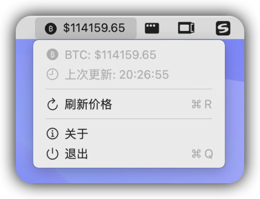

# BTC 价格监控器

<div align="center">


一款专业的 macOS 菜单栏应用，用于实时监控 BTC 价格，之前使用Python写过虽然也蛮好用但最终还是决定用macOS原生语言开发，已经编译了`Intel`与`Apple Silicon`的通用应用，请至releases下载。

[功能特性](#功能特性) • [安装要求](#安装要求) • [快速开始](#快速开始) • [使用说明](#使用说明) • [技术架构](#技术架构)

</div>

## 📖 如在macOS下无法运行，请执行以下步骤：
> 系统设置 → 隐私与安全性 → 安全性 → 已阻止“Bitcoin Monitoring。app”以保护Mac → 仍要打开

## 📷︎ 界面预览



## ✨ 功能特性

### 🚀 核心功能
- **实时价格显示**: 在菜单栏实时显示 BTC/USDT 价格
- **自动刷新机制**: 每 30 秒自动获取最新价格数据
- **智能错误重试**: 网络异常时自动重试，最多 3 次
- **手动刷新**: 支持快捷键 `Cmd+R` 手动刷新价格
- **状态指示**: 直观显示加载、更新、错误状态

### 🎨 用户体验
- **SF Symbols 图标**: 使用原生 macOS 图标系统
- **中文界面**: 完整的中文用户界面
- **优雅动画**: 流畅的状态切换动画
- **轻量级设计**: 最小化系统资源占用
- **后台运行**: 不占用 Dock 空间，专注菜单栏

### 🛡️ 可靠性
- **网络容错**: 完善的网络异常处理机制
- **内存管理**: 避免循环引用，及时释放资源
- **线程安全**: UI 更新确保在主线程执行
- **错误恢复**: 自动从临时网络故障中恢复

## 📋 安装要求

### 系统要求
- **操作系统**: macOS 12.4 或更高版本
- **推荐版本**: macOS 14.8 或更高版本
- **架构支持**: Intel 和 Apple Silicon (M1/M2/M3/M4/M5)

### 开发环境
- **开发工具**: Xcode 16.2 或更高版本
- **Swift 版本**: Swift 5.0
- **部署目标**: macOS 14.8

### 网络要求
- 需要稳定的互联网连接
- 访问币安 API (`https://api.binance.com`) 的网络权限

## 🚀 快速开始

### 方式一：直接运行 (推荐)

1. **克隆项目**
   ```bash
   git clone https://github.com/your-username/btc-price-monitor.git
   cd btc-price-monitor
   ```

2. **在 Xcode 中打开**
   ```bash
   open "Bitcoin Monitoring.xcodeproj"
   ```

3. **运行应用**
   - 在 Xcode 中选择 "Bitcoin Monitoring" scheme
   - 点击运行按钮或使用 `Cmd+R`

### 方式二：命令行构建

1. **构建项目**
   ```bash
   xcodebuild -project "Bitcoin Monitoring.xcodeproj" \
              -scheme "Bitcoin Monitoring" \
              -configuration Debug build
   ```

2. **运行应用**
   ```bash
   open "build/Debug/Bitcoin Monitoring.app"
   ```

### 方式三：发布版本构建

1. **构建发布版本**
   ```bash
   xcodebuild -project "Bitcoin Monitoring.xcodeproj" \
              -scheme "Bitcoin Monitoring" \
              -configuration Release archive
   ```

2. **导出应用**
   - 在 Xcode Organizer 中选择归档
   - 点击 "Distribute App" 并选择 "Copy App"
   - 将应用拖到 Applications 文件夹

## 📖 使用说明

### 基本操作

1. **启动应用**
   - 应用启动后自动在菜单栏显示 BTC 图标
   - 首次启动会显示 "加载中..." 状态

2. **查看价格**
   - 菜单栏实时显示当前 BTC 价格
   - 格式：`$价格` (例如: `$43,250.50`)

3. **交互菜单**
   - 点击菜单栏图标显示详细菜单
   - 查看更多信息并执行操作

### 菜单功能

| 功能 | 描述 | 快捷键 |
|------|------|--------|
| 价格信息 | 显示当前 BTC 价格和状态 | - |
| 错误信息 | 显示网络错误详情 (如有) | - |
| 更新时间 | 显示上次成功更新时间 | - |
| 刷新价格 | 手动获取最新价格 | `Cmd+R` |
| 关于 | 查看应用信息和版本 | - |
| 退出 | 完全退出应用 | `Cmd+Q` |

### 状态说明

| 状态 | 显示 | 说明 |
|------|------|------|
| 加载中 | `加载中...` | 首次启动，正在获取数据 |
| 更新中 | `更新中...` | 正在获取最新价格 |
| 错误 | `错误` | 网络连接或 API 异常 |
| 正常 | `$价格` | 成功显示当前价格 |

## 🏗️ 技术架构

### 架构概览

```
BTC价格监控器架构
├── 应用层 (App Layer)
│   ├── test1App.swift (应用入口)
│   └── AppDelegate (应用生命周期)
├── 界面层 (UI Layer)
│   └── BTCMenuBarApp.swift (菜单栏控制器)
├── 业务层 (Business Layer)
│   └── PriceManager.swift (价格管理器)
├── 服务层 (Service Layer)
│   └── PriceService.swift (网络服务)
└── 数据层 (Data Layer)
    └── BTCPriceResponse.swift (数据模型)
```

### 核心组件

#### **test1App.swift**
- **职责**: 应用程序入口点
- **功能**:
  - 配置应用为后台模式
  - 创建和初始化菜单栏应用
  - 管理应用生命周期

#### **BTCMenuBarApp.swift**
- **职责**: 菜单栏界面控制器
- **功能**:
  - 管理状态栏图标和文本
  - 处理用户交互事件
  - 显示上下文菜单
  - 更新 UI 状态

#### **PriceManager.swift**
- **职责**: 价格数据管理器 (@MainActor)
- **功能**:
  - 定时刷新机制 (30秒间隔)
  - 智能重试策略 (最多3次)
  - Combine 发布者模式
  - 状态管理和错误处理

#### **PriceService.swift**
- **职责**: 网络请求服务层
- **功能**:
  - 币安 API 集成
  - HTTP 网络请求处理
  - JSON 数据解析
  - 网络错误处理

#### **BTCPriceResponse.swift**
- **职责**: API 响应数据模型
- **功能**:
  - Codable 协议支持
  - 数据验证和转换
  - 类型安全的属性访问

### 设计模式

- **MVVM 架构**: SwiftUI + ObservableObject 模式
- **Combine 框架**: 响应式数据流和事件处理
- **依赖注入**: 服务层分离和松耦合设计
- **单例模式**: PriceService 网络服务管理
- **观察者模式**: 价格变化的响应式更新

### 并发处理

```swift
// 主线程 UI 更新
@MainActor
class BTCMenuBarApp: ObservableObject

// 异步网络请求
func fetchPrice() async throws -> Double

// Combine 响应式流
priceManager.$currentPrice
    .receive(on: DispatchQueue.main)
    .sink { [weak self] price in
        self?.updateMenuBarTitle(price: price)
    }
```

## 🌐 API 集成

### 币安 API 端点

```http
GET https://api.binance.com/api/v3/ticker/price?symbol=BTCUSDT
```

### 请求参数

| 参数 | 类型 | 必需 | 描述 |
|------|------|------|------|
| symbol | String | 是 | 交易对符号 (BTCUSDT) |

### 响应格式

```json
{
  "symbol": "BTCUSDT",
  "price": "43250.50"
}
```

### 错误处理策略

1. **网络连接失败**
   - 自动重试机制 (最多3次)
   - 递增延迟策略 (1秒, 2秒, 4秒)
   - 用户友好的错误提示

2. **API 服务器错误**
   - HTTP 状态码检查
   - 服务器响应验证
   - 优雅降级处理

3. **数据解析异常**
   - JSON 格式验证
   - 数据类型检查
   - 价格格式验证

4. **无效价格格式**
   - 数值范围检查
   - 格式规范化
   - 异常值过滤

## 🛠️ 开发指南

### 添加新功能

#### 1. 添加新的加密货币支持

```swift
// 在 BTCPriceResponse.swift 中扩展
struct CryptoPriceResponse: Codable {
    let symbol: String
    let price: String
}

// 在 PriceService.swift 中添加新方法
func fetchETHPrice() async throws -> Double {
    // 实现 ETH 价格获取逻辑
}
```

#### 2. 添加价格历史功能

```swift
// 在 PriceManager.swift 中添加
@Published var priceHistory: [Double] = []

func updatePriceHistory(_ price: Double) {
    priceHistory.append(price)
    if priceHistory.count > 100 {
        priceHistory.removeFirst()
    }
}
```

#### 3. 添加价格警报功能

```swift
// 在 BTCMenuBarApp.swift 中扩展
struct PriceAlert {
    let targetPrice: Double
    let direction: AlertDirection
}

enum AlertDirection {
    case above, below
}
```

### 代码规范

#### Swift 命名约定
```swift
// 类名：大驼峰命名
class PriceManager

// 方法名：小驼峰命名
func fetchPrice()

// 变量名：小驼峰命名
let currentPrice

// 常量：全大写
let API_BASE_URL = "https://api.binance.com"
```

#### 注释规范
```swift
/// 价格数据管理器
///
/// 负责管理 BTC 价格的获取、缓存和分发。
/// 使用 Combine 框架提供响应式数据流。
@MainActor
class PriceManager: ObservableObject {

    /// 当前 BTC 价格
    @Published var currentPrice: Double = 0.0

    /// 获取最新价格
    /// - Throws: PriceError 网络或解析错误
    func refreshPrice() async {
        // 实现逻辑
    }
}
```

### 调试技巧

#### 1. 启用详细日志
```swift
// 在 PriceService.swift 中添加
private enum LogLevel {
    case info, warning, error
}

private func log(_ message: String, level: LogLevel = .info) {
    let timestamp = DateFormatter.iso8601.string(from: Date())
    print("[\(timestamp)] [\(level)] \(message)")
}
```

#### 2. 网络请求调试
```swift
// 使用 Xcode 网络调试器
// Product → Scheme → Edit Scheme → Run → Diagnostics
// 启用 "Network" 选项

// 或者在代码中添加调试信息
func fetchPrice() async throws -> Double {
    log("开始获取 BTC 价格", level: .info)

    let startTime = CFAbsoluteTimeGetCurrent()
    defer {
        let duration = CFAbsoluteTimeGetCurrent() - startTime
        log("请求完成，耗时: \(String(format: "%.2f", duration))秒")
    }

    // 网络请求实现
}
```

### 性能优化

#### 1. 定时器优化
```swift
// 使用 weak self 避免循环引用
Timer.scheduledTimer(withTimeInterval: 30.0, repeats: true) { [weak self] _ in
    Task { @MainActor in
        await self?.refreshPrice()
    }
}
```

#### 2. 网络请求优化
```swift
// 添加请求缓存
private var lastFetchTime: Date = Date.distantPast
private let cacheInterval: TimeInterval = 25.0 // 25秒缓存

func fetchPrice() async throws -> Double {
    let now = Date()
    if now.timeIntervalSince(lastFetchTime) < cacheInterval {
        return cachedPrice
    }

    // 执行网络请求
    lastFetchTime = now
    return try await performNetworkRequest()
}
```

#### 3. UI 更新优化
```swift
// 批量 UI 更新
DispatchQueue.main.async { [weak self] in
    guard let self = self else { return }

    // 批量更新 UI 元素
    self.updateMenuBarIcon()
    self.updateMenuBarTitle()
    self.updateMenuItems()
}
```

## 🔧 故障排除

### 常见问题

#### 1. 应用无法启动

**问题**: 双击应用图标无反应
**解决方案**:
```bash
# 检查系统完整性
xattr -d com.apple.quarantine "/Applications/Bitcoin Monitoring.app"

# 或者在系统偏好设置中允许应用运行
# 系统偏好设置 → 安全性与隐私 → 通用
```

#### 2. 网络连接失败

**问题**: 显示"错误"状态，无法获取价格
**诊断步骤**:
1. 检查网络连接
```bash
ping api.binance.com
```

2. 验证 API 可用性
```bash
curl "https://api.binance.com/api/v3/ticker/price?symbol=BTCUSDT"
```

3. 检查防火墙设置
```bash
# 确保允许出站 HTTPS 连接
```

## 🤝 贡献指南

我们欢迎所有形式的贡献！请阅读以下指南：

### 贡献方式

1. **报告 Bug**: 在 Issues 中提交详细的 Bug 报告
2. **功能建议**: 提出新功能的想法和建议
3. **代码贡献**: 提交 Pull Request 改进代码
4. **文档完善**: 改进 README 和代码注释

## 📄 许可证

本项目采用 **GNU General Public License v3.0** 许可证。

### 完整许可证文本

详见 [LICENSE](LICENSE) 文件。

## 👨‍💻 作者

**Mark**

- **GitHub**: [@jiayouzl](https://github.com/jiayouzl/)
- **项目主页**: [https://github.com/jiayouzl/Bitcoin-Monitoring](https://github.com/jiayouzl/Bitcoin-Monitoring)

---

<div align="center">

**⭐ 如果这个项目对你有帮助，请给它一个 Star！**

Made with ❤️ for the Bitcoin community

</div>